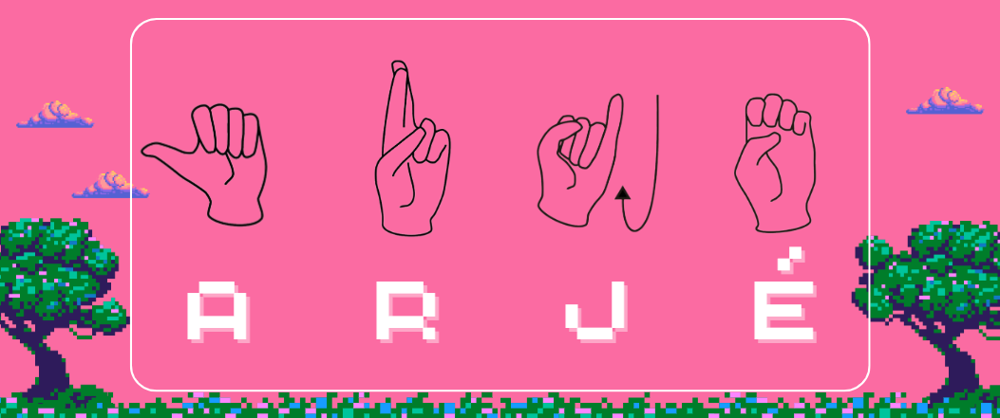

# A R J É

#### Objective

Our main objective is to be able to use the object-oriented programming paradigm in a project that could serve as a precursor to a product with real significance. The "ARJÉ project is a sign language to natural language transcriber. For the Greek philosophers, Arjé meant the first element or the fundamental principle of things, and one of our goals is precisely for this project to be the fundamental principle of a world in which communication and language or speech disabilities are not a barrier to the full and enriching interaction of all individuals.

#### Relevance

The relevance of this project lies in the creation of a tool that can have a significant impact on the lives of individuals with hearing and speech disabilities (deaf-mute individuals). Facilitating communication between deaf-mute individuals and hearing individuals is essential for their full participation in society. Moreover, this type of technology can find applications in educational, workplace, medical, and social settings, contributing to equal opportunities and the inclusion of individuals.

#### Limitations 

##### The project presents several limitations, such as: 

###### •	The system should ideally be bidirectional, meaning it should facilitate communication between sign language users and non-sign language users by translating both from sign language to natural language (in this case, written language) and from natural or spoken language to sign language. However, in our project, we will focus solely on transcribing from sign language to natural language.

###### •	The system only transcribes individual letters of sign language rather than directly translating full phrases. This limitation is due to the complexity involved in direct phrase translation, and the project has a limited timeframe for development. Users will need to manually assemble words or phrases using the Mexican Sign Language alphabet.

###### •	Sign languages are specific to each language, but this program only considers Mexican Sign Language.

###### •	The system may face challenges in adapting to environments with variable lighting conditions or situations where gestures are performed in unconventional ways.

 [Contributions](docs/Contributions/readme.md)
 
[Meetings](docs/Meetings/readme.md)

[Requirements](docs/Requirements/FunctionalRequirements.pdf)

[User Stories](docs/Requirements/UserStories&AcceptanceCriteria.pdf)

[ClassDiagram](docs/UML/ClassDiagram/readme.md)

