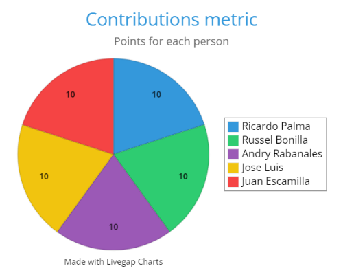

<h1>Contributions</h1>

<table>
<!-- Titles -->
<tr>
  <td><strong>Activity</strong></td>
  <td><strong>Work Contributions</strong></td>
  <td><strong>Complexity</strong></td>
  <td><strong>Done?</strong></td>
</tr>
<!-- Este es un comentario oculto en Markdown -->
<tr>
  <td>1.-Product Description </td>
  <td>Russel</td>
  <td><em>Difficulty:</em> Lvl.1</td>
  <td>Yes</td>
</tr>
<!-- Este es un comentario oculto en Markdown -->
<tr>
    <td>2.-To define Functional Requirements and Non-Functional Requirements specified and prioritized (RNF's are optional and must be quantifiable)</td>
    <td>All the team</td>
    <td><em>Difficulty:</em> Lvl.2</td>
    <td>Yes</td>
</tr>
<!-- Este es un comentario oculto en Markdown -->
<tr>
  <td>3.-To make User Story diagrams with acceptance criteria or use case diagrams  </td>
  <td>Juan </td>
 <td><em>Difficulty:</em> Lvl.2</td>
  <td>Yes</td>
</tr>
<!-- Este es un comentario oculto en Markdown -->
<tr>
  <td>4.Clear and concrete evidence of the process of abstracting functional requirements to convert them into classes  </td>
  <td>(The entire team will work on this, but individually depending on the functional requirement that they had) </td>
 <td><em>Difficulty:</em> Lvl.2</td>
  <td>Yes</td>
</tr>
<!-- Este es un comentario oculto en Markdown -->
<tr>
  <td>5.-Class diagram with clear and specific relations  </td>
  <td>All the team will work on this </td>
 <td><em>Difficulty:</em> Lvl.2</td>
  <td>Yes</td>
</tr>
<!-- Este es un comentario oculto en Markdown -->
<tr>
  <td>6.-To make a table indicating contribution metrics to github </td>
  <td>Andry </td>
 <td><em>Difficulty:</em> Lvl.1</td>
  <td>Yes</td>
</tr>
<!-- Este es un comentario oculto en Markdown -->
<tr>
  <td>7.-To make a history of meetings and agreements(binnacle)</td>
  <td>Andry </td>
 <td><em>Difficulty:</em> Lvl.1</td>
  <td>Yes</td>
</tr>
<!-- Este es un comentario oculto en Markdown -->
<tr>
  <td>8.-To organize activities to be done and meetings </td>
  <td>Russel</td>
 <td><em>Difficulty:</em> Lvl.1</td>
  <td>Yes</td>
</tr>
<!-- Este es un comentario oculto en Markdown -->
<tr>
  <td>9.-Slides and videos </td>
  <td>Palma and Jose Luis</td>
 <td><em>Difficulty:</em> Lvl.2</td>
  <td>Yes</td>
</tr>
</table>

