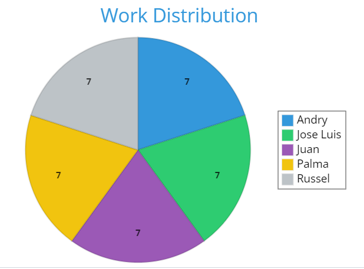
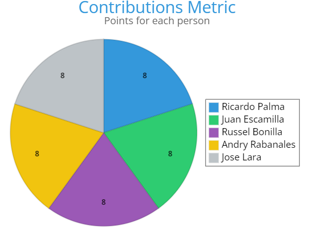
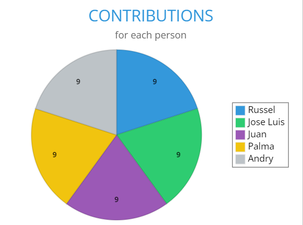

<h1>Contributions</h1>

<h2>Contributions First Review</h2>

<table>
<!-- Titles -->
<tr>
  <td><strong>Activity</strong></td>
  <td><strong>Work Contributions</strong></td>
  <td><strong>Score</strong></td>
</tr>
<!-- Este es un comentario oculto en Markdown -->
<tr>
  <td>1.-Product Description </td>
  <td>Russel</td>
  <td>1 pt</td>
</tr>
<!-- Este es un comentario oculto en Markdown -->
<tr>
    <td>2.-To define Functional Requirements and Non-Functional Requirements specified and prioritized (RNF's are optional and must be quantifiable)</td>
    <td>All the team</td>
    <td>2 pts</td>
</tr>
<!-- Este es un comentario oculto en Markdown -->
<tr>
  <td>3.-To make User Story diagrams with acceptance criteria or use case diagrams  </td>
  <td>Juan </td>
 <td>2 pts</td>
</tr>
<!-- Este es un comentario oculto en Markdown -->
<tr>
  <td>4.Clear and concrete evidence of the process of abstracting functional requirements to convert them into classes  </td>
  <td>(The entire team will work on this, but individually depending on the functional requirement that they had) </td>
 <td>2 pts</td>
</tr>
<!-- Este es un comentario oculto en Markdown -->
<tr>
  <td>5.-Class diagram with clear and specific relations  </td>
  <td>All the team will work on this </td>
 <td>2 pts</td>
</tr>
<!-- Este es un comentario oculto en Markdown -->
<tr>
  <td>6.-To make a table indicating contribution metrics to github </td>
  <td>Andry </td>
 <td>1 pt</td>
</tr>
<!-- Este es un comentario oculto en Markdown -->
<tr>
  <td>7.-To make a history of meetings and agreements(binnacle)</td>
  <td>Andry </td>
 <td>1 pt</td>
</tr>
<!-- Este es un comentario oculto en Markdown -->
<tr>
  <td>8.-To organize activities to be done and meetings </td>
  <td>Russel</td>
 <td>1 pt</td>
</tr>
<!-- Este es un comentario oculto en Markdown -->
<tr>
  <td>9.-Slides and videos </td>
  <td>Palma and Jose Luis</td>
 <td>2 pts</td>
</tr>
</table>

<h2>Contributions Second Review</h2>

<table>
<!-- Titles -->
<tr>
  <td><strong>Activity</strong></td>
  <td><strong>Work distribution</strong></td>
  <td><strong>Score</strong></td>
</tr>
<!-- Este es un comentario oculto en Markdown -->
<tr>
  <td>Description of the evolution of the project in general</td>
  <td>Russel</td>
  <td>1 pt</td>
</tr>
<!-- Este es un comentario oculto en Markdown -->
<tr>
  <td>Re-define functional requirements and non-functional requirements (if necessary)</td>
  <td>All the team</td>
  <td>1 pt</td>
</tr>
<!-- Este es un comentario oculto en Markdown -->
<tr>
  <td>Remake User Story diagrams with acceptance criteria or use case diagrams (if necessary)</td>
  <td>Juan</td>
  <td>2 pts</td>
</tr>
<!-- Este es un comentario oculto en Markdown -->
<tr>
  <td>Complete and/or redo the class diagrams (only the mvc ones, not the python c# connection ones) (we can even put the drawing of the mvc cookie and a brief description of what mvc is)</td>
  <td>Andry,Juan and Russel</td>
  <td>2 pts</td>
</tr>
<!-- Este es un comentario oculto en Markdown -->
<tr>
  <td>Add the artifact indicating contribution metrics to github</td>
  <td>Andry</td>
  <td>1 pt</td>
</tr>
<!-- Este es un comentario oculto en Markdown -->
<tr>
  <td>Record of meetings and agreements (binnacle)</td>
  <td>Andry</td>
  <td>1 pt</td>
</tr>
<!-- Este es un comentario oculto en Markdown -->
<tr>
  <td>Presentation and video (creative freedom, entertaining, balanced slides..., in English, with relevant information, 5 minutes maximum)</td>
  <td>Andry, Juan and Russel</td>
  <td>2 pt</td>
</tr>
<!-- Este es un comentario oculto en Markdown -->
<tr>
  <td>Program a part of the model</td>
  <td>Palma, Jose Luis</td>
  <td>3 pt</td>
</tr>
<!-- Este es un comentario oculto en Markdown -->
<tr>
  <td>Program a part of the model controller</td>
  <td>Palma, Jose Luis</td>
  <td>3 pt</td>
</tr>
</table>

<h2>Contributions Third Review</h2>

<table>
<!-- Titles -->
<tr>
  <td><strong>Activity</strong></td>
  <td><strong>Work Contributions</strong></td>
  <td><strong>Score</strong></td>
</tr>
<!-- Este es un comentario oculto en Markdown -->
<tr>
  <td>1.-Description of the evolution of the product (Mention in a summarized way the most significant changes and that there is evidence.) </td>
  <td>Russel</td>
  <td>1 pt</td>
</tr>
<!-- Este es un comentario oculto en Markdown -->
<tr>
    <td>2.-Description of the evolution of the requirements/artifacts</td>
    <td>All the team</td>
    <td>1 pts</td>
</tr>
<!-- Este es un comentario oculto en Markdown -->
<tr>
  <td>3.-Class diagram </td>
  <td>Juan </td>
 <td>2 pts</td>
</tr>
<!-- Este es un comentario oculto en Markdown -->
<tr>
  <td>4.-Verificación de los requerimientos funcionales y no funcionales </td>
  <td>(The entire team will work on this, but individually depending on the functional requirement that they had) </td>
 <td>2 pts</td>
</tr>
<!-- Este es un comentario oculto en Markdown -->
<tr>
  <td>5.-Artifact that indicates the total contribution metrics (of the three deliveries in one) </td>
  <td>All the team will work on this </td>
 <td>1 pt</td>
</tr>
<!-- Este es un comentario oculto en Markdown -->
<tr>
  <td>6.-Record of meetings and agreements (binnacle) </td>
  <td>Andry </td>
 <td>1 pt</td>
</tr>
<!-- Este es un comentario oculto en Markdown -->
<tr>
  <td>7.-Organize activities to be carried out and meetings</td>
  <td>Andry </td>
 <td>1 pt</td>
</tr>
<!-- Este es un comentario oculto en Markdown -->
<tr>
  <td>8.-Description of the process (There is explicit evidence of (the) sprints: the size of the sprint, planning, activities, those responsible, roles, results.)</td>
  <td>Russel</td>
 <td>1 pt</td>
</tr>
<!-- Este es un comentario oculto en Markdown -->
<tr>
  <td>9.-Presentation and video (balanced slides..., in English, with relevant information, 5 minutes)</td>
  <td>Palma and Jose Luis</td>
 <td>2 pts</td>
</tr>

<!-- Este es un comentario oculto en Markdown -->
<tr>
  <td>10.-Programming a part of the View</td>
  <td>Palma and Jose Luis</td>
 <td>3 pts</td>
</tr>

<!-- Este es un comentario oculto en Markdown -->
<tr>
  <td>11.-Programming other part of the View</td>
  <td>Palma and Jose Luis</td>
 <td>3 pts</td>
</tr>

<!-- Este es un comentario oculto en Markdown -->
<tr>
  <td>12.-Controller programming </td>
  <td>Palma and Jose Luis</td>
 <td>3 pts</td>
</tr>

<!-- Este es un comentario oculto en Markdown -->
<tr>
  <td>13.-Programming of Utils classes used by mvc </td>
  <td>Palma and Jose Luis</td>
 <td>3 pts</td>
</tr>

<!-- Este es un comentario oculto en Markdown -->
<tr>
  <td>14.-Programming mentors</td>
  <td>Palma and Jose Luis</td>
 <td>3 pts</td>
</tr>

<tr>
  <td>15.-Non-functional UI prototype </td>
  <td>Palma and Jose Luis</td>
 <td>2 pts</td>
</tr>

<!-- Este es un comentario oculto en Markdown -->
<tr>
  <td>16.-Programming of Utils classes used by the mvc (With the mentoring of Palma)</td>
  <td>Palma and Jose Luis</td>
 <td>3pts</td>
</tr>

<!-- Este es un comentario oculto en Markdown -->
<tr>
  <td>17.-Model training </td>
  <td>Palma and Jose Luis</td>
 <td>2 pts</td>
</tr>

<!-- Este es un comentario oculto en Markdown -->
<tr>
  <td>18.-Writing generic and disciplinary competencies on GitHub</td>
  <td>Palma and Jose Luis</td>
 <td>1 pt1</td>
</tr>

<!-- Este es un comentario oculto en Markdown -->
<tr>
  <td>19.-Writing on GitHub of the Areas for improvement</td>
  <td>Palma and Jose Luis</td>
 <td>1 pt1</td>
</tr>

</table>

