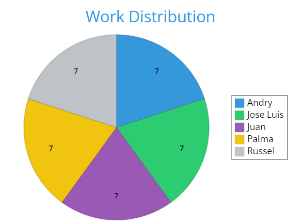

<table>
<!-- Titles -->
<tr>
  <td><strong>Activity</strong></td>
  <td><strong>Work distribution</strong></td>
  <td><strong>Score</strong></td>
</tr>
<!-- Este es un comentario oculto en Markdown -->
<tr>
  <td>Description of the evolution of the project in general</td>
  <td>Russel</td>
  <td>1 pt</td>
</tr>
<!-- Este es un comentario oculto en Markdown -->
<tr>
  <td>Re-define functional requirements and non-functional requirements (if necessary)</td>
  <td>All the team</td>
  <td>1 pt</td>
</tr>
<!-- Este es un comentario oculto en Markdown -->
<tr>
  <td>Remake User Story diagrams with acceptance criteria or use case diagrams (if necessary)</td>
  <td>Juan</td>
  <td>2 pts</td>
</tr>
<!-- Este es un comentario oculto en Markdown -->
<tr>
  <td>Complete and/or redo the class diagrams (only the mvc ones, not the python c# connection ones) (we can even put the drawing of the mvc cookie and a brief description of what mvc is)</td>
  <td>Andry,Juan and Russel</td>
  <td>2 pts</td>
</tr>
<!-- Este es un comentario oculto en Markdown -->
<tr>
  <td>Add the artifact indicating contribution metrics to github</td>
  <td>Andry</td>
  <td>1 pt</td>
</tr>
<!-- Este es un comentario oculto en Markdown -->
<tr>
  <td>Record of meetings and agreements (binnacle)</td>
  <td>Andry</td>
  <td>1 pt</td>
</tr>
<!-- Este es un comentario oculto en Markdown -->
<tr>
  <td>Presentation and video (creative freedom, entertaining, balanced slides..., in English, with relevant information, 5 minutes maximum)</td>
  <td>Andry, Juan and Russel</td>
  <td>2 pt</td>
</tr>
<!-- Este es un comentario oculto en Markdown -->
<tr>
  <td>Program a part of the model</td>
  <td>Palma, Jose Luis</td>
  <td>3 pt</td>
</tr>
<!-- Este es un comentario oculto en Markdown -->
<tr>
  <td>Program a part of the model controller</td>
  <td>Palma, Jose Luis</td>
  <td>3 pt</td>
</tr>
</table>

