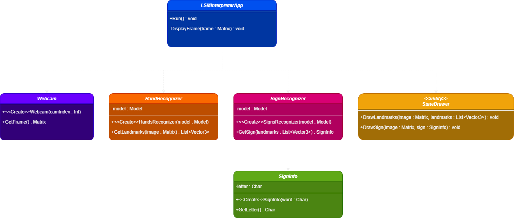

# Diagram:

# Classes:

<table>
<thead>
  <tr>
    <th colspan="2">LSMInterpreterApp</th>
  </tr>
</thead>
<tbody>
  <tr>
    <td rowspan="2">Methods</td>
    <td>+Run() : void</td>
  </tr>
  <tr>
    <td>-DisplayFrame(frame : Matrix) : void</td>
  </tr>
</tbody>
</table>

<table>
<thead>
  <tr>
    <th colspan="2">Webcam</th>
  </tr>
</thead>
<tbody>
  <tr>
    <td rowspan="2">Methods</td>
    <td>+&lt;&lt;Create>>Webcam(camIndex : Int)</td>
  </tr>
  <tr>
    <td>+GetFrame() : Matrix</td>
  </tr>
</tbody>
</table>

<table>
<thead>
  <tr>
    <th colspan="2">HandRecognizer</th>
  </tr>
</thead>
<tbody>
  <tr>
    <td rowspan="1">Attributes</td>
    <td>-model : Model </td>
  </tr>
  <tr>
    <td rowspan="2">Methods</td>
    <td>+&lt;&lt;Create&gt;&gt;HandsRecognizer(model : Model)</td>
  </tr>
  <tr>
    <td>+GetLandmarks(image : Matrix) : List&lt;Vector3&gt;</td>
  </tr>
</tbody>
</table>

<table>
<thead>
  <tr>
    <th colspan="2">SignRecognizer</th>
  </tr>
</thead>
<tbody>
  <tr>
    <td rowspan="2">Attributes</td>
    <td>-model : Model</td>
  </tr>
  <tr>
  </tr>
  <tr>
    <td rowspan="2">Methods</td>
    <td>+&lt;&lt;Create&gt;&gt;SingsRecognizer(model : Model)</td>
  </tr>
  <tr>
    <td>+GetSign(landmarks : List&lt;Vector3&gt;) : SingInfo</td>
  </tr>
</tbody>
</table>

<table>
<thead>
  <tr>
    <th colspan="2">SignInfo</th>
  </tr>
</thead>
<tbody>
  <tr>
    <td rowspan="2">Attributes</td>
    <td>-letter : Char
</td>
  </tr>
  <tr>
  </tr>
  <tr>
    <td rowspan="2">Methods</td>
    <td>+&lt;&lt;Create&gt;&gt;SignInfo(word : Char)</td>
  </tr>
  <tr>
    <td>+GetLetter() : Char</td>
  </tr>
</tbody>
</table>

<table>
<thead>
  <tr>
    <th colspan="2">&lt;&lt;utility&gt;&gt; StateDrawer</th>
  </tr>
</thead>
<tbody>
  <tr>
    <td rowspan="2">Methods</td>
    <td>+DrawLandmarks(image : Matrix, landmarks : List<Vector3>) : void</td>
  </tr>
  <tr>
    <td>+DrawSign(image : Matrix, sign : SignInfo) : void</td>
  </tr>
</tbody>

</table>
